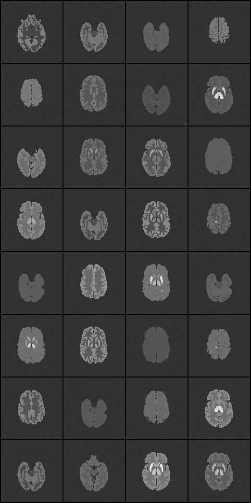

# DeepMed-Imaging-Reconstruction
Normalizing flow research sandbox for medical imaging (PET, MRI)

## References
- Deep Probabilistic Imaging (AAAI 2021): https://github.com/HeSunPU/DPI  
- Normalizing Flows are Capable Generative Models (TARFlow): https://github.com/apple/ml-tarflow


## PET Unconditional Training using TARFlow

Prepare FID stats
```bash
torchrun --standalone --nproc_per_node=2 prepare_fid_stats.py --dataset=pet --img_size=128
```

2xH100, 6mins/epoch 
```bash
torchrun --standalone --nproc_per_node=2 train.py --dataset=pet --img_size=128 --channel_size=1\
  --patch_size=4 --channels=1024 --blocks=8 --layers_per_block=8\
  --noise_std=0.15 --batch_size=32 --epochs=150 --lr=1e-5 --nvp --cfg=0 --drop_label=0.1\
  --sample_freq=15 --logdir=runs/pet128 --num_samples=256 
```

Set noise_std=0.01
```bash
torchrun --standalone --nproc_per_node=2 train.py --dataset=pet --img_size=128 --channel_size=1\
  --patch_size=4 --channels=1024 --blocks=8 --layers_per_block=8\
  --noise_std=0.01 --batch_size=32 --epochs=300 --lr=1e-5 --nvp --cfg=0 --drop_label=0.1\
  --sample_freq=20 --logdir=runs/pet128 --num_samples=256
```


Resize dataset to 12000
```bash
python resize_dataset.py --size 12000
torchrun --standalone --nproc_per_node=2 prepare_fid_stats.py --dataset=pet_12000 --img_size=128
```
```bash
torchrun --standalone --nproc_per_node=2 train.py --dataset=pet_12000 --img_size=128 --channel_size=1\
  --patch_size=4 --channels=1024 --blocks=8 --layers_per_block=8\
  --noise_std=0.01 --batch_size=32 --epochs=300 --lr=1e-5 --nvp --cfg=0 --drop_label=0.1\
  --sample_freq=20 --logdir=runs/pet128_12000 --num_samples=256
```

### AFHQ Training using TARFlow
AFHQ dataset: https://www.kaggle.com/datasets/dimensi0n/afhq-512

```python
import kagglehub

# Download latest version
path = kagglehub.dataset_download("dimensi0n/afhq-512")

print("Path to dataset files:", path)
```
#### Prepare FID stats
```bash
torchrun --standalone --nproc_per_node=2 prepare_fid_stats.py --dataset=afhq --img_size=256
```
```bash
torchrun --standalone --nproc_per_node=2 prepare_fid_stats.py --dataset=afhq --img_size=128
```
```bash
torchrun --standalone --nproc_per_node=2 prepare_fid_stats.py --dataset=afhq --img_size=64
```
#### Training
Original config: need to run on 4 nodes, 32 GPUs total
```bash  
  torchrun --standalone --nproc_per_node=8 train.py --dataset=afhq --img_size=128 --channel_size=3\
  --patch_size=4 --channels=1024 --blocks=8 --layers_per_block=8\
  --noise_std=0.15 --batch_size=768 --epochs=320 --lr=1e-4 --nvp --cfg=0 --drop_label=0.1\
  --sample_freq=20 --logdir=runs/afhq128
```
Other configs remain the same, batch_size reduced to 1/12, 5 minutes/epoch, correspondingly need 2 hours, occupying 93GB x 2
```bash  
  torchrun --standalone --nproc_per_node=2 train.py --dataset=afhq --img_size=128 --channel_size=3\
  --patch_size=4 --channels=1024 --blocks=8 --layers_per_block=8\
  --noise_std=0.15 --batch_size=64 --epochs=27 --lr=1e-5 --nvp --cfg=0 --drop_label=0.1\
  --sample_freq=3 --logdir=runs/afhq128
```
Other configs remain the same, batch_size reduced to 1/24, 9 minutes/epoch, correspondingly need 2 hours, occupying 93GB
```bash  
CUDA_VISIBLE_DEVICES=1 \
torchrun --standalone --nproc_per_node=1 train.py --dataset=afhq --img_size=128 --channel_size=3\
  --patch_size=4 --channels=1024 --blocks=8 --layers_per_block=8\
  --noise_std=0.15 --batch_size=32 --epochs=150 --lr=1e-5 --nvp --cfg=0 --drop_label=0.1\
  --sample_freq=10 --logdir=runs/afhq128
```

Channels reduced to half, and batch_size reduced to 1/12, need 21 days, occupying 44GB x 2
```bash  
  torchrun --standalone --nproc_per_node=2 train.py --dataset=afhq --img_size=128 --channel_size=3\
  --patch_size=4 --channels=512 --blocks=8 --layers_per_block=8\
  --noise_std=0.15 --batch_size=64 --epochs=15360 --lr=1e-4 --nvp --cfg=0 --drop_label=0.1\
  --sample_freq=20 --logdir=runs/afhq128
```
Channels reduced to half, and batch_size reduced to 1/6, need 10.6 days, occupying 82GB x 2
```bash  
  torchrun --standalone --nproc_per_node=2 train.py --dataset=afhq --img_size=128 --channel_size=3\
  --patch_size=4 --channels=512 --blocks=8 --layers_per_block=8\
  --noise_std=0.15 --batch_size=128 --epochs=7680 --lr=1e-4 --nvp --cfg=0 --drop_label=0.1\
  --sample_freq=20 --logdir=runs/afhq128
```
